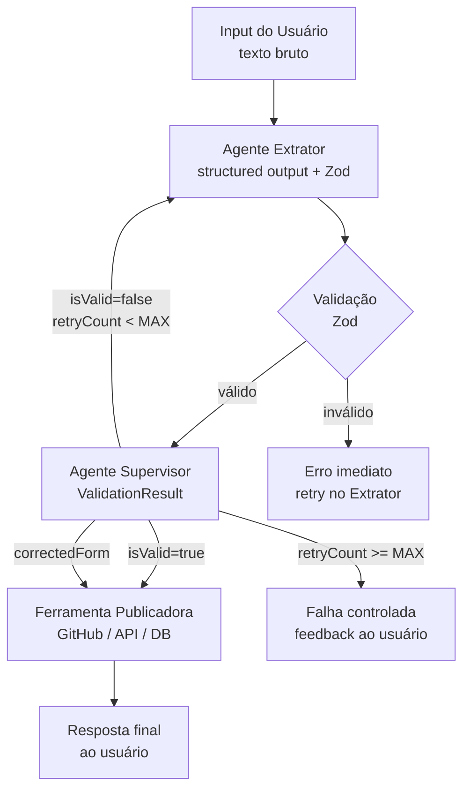

# Spec: Arquitetura do Boilerplate Multi-Agente

**Versão:** 1.0
**Status:** Referência
**Autor:** Boro Agent
**Data:** 2026-03-13

---

## 1. Resumo

Este documento define a arquitetura de referência para criar agentes de alta assertividade dentro do Boro. O padrão é extraído do `boro-talent-aquisition-worker` (projeto antigo), que demonstrou empiricamente maior qualidade na geração de outputs estruturados por adotar um pipeline multi-agente com validação explícita, em vez de depender exclusivamente de instruções de prompt.

A arquitetura combina:
- A **infraestrutura existente** do Boro (Telegram, SQLite, AgentLoop, SkillSystem)
- O **padrão multi-agente** do projeto antigo (Extrator → Supervisor → Publicador)

---

## 2. Contexto e Motivação

**Problema:**
Skills simples com um único LLM call sofrem de "alucinação silenciosa": o modelo retorna dados incompletos ou malformados sem que nenhum mecanismo detecte o problema. O output vai para a ferramenta final com defeito.

**Evidências:**
O projeto antigo demonstrou que o mesmo texto de vaga, processado por um único agente (projeto novo/skill), frequentemente gerava campos enum inválidos, títulos com emojis e stacks vazias. Com o pipeline TechRecruiter → Supervisor, o índice de issues bem formadas chegou a ~100%.

**Por que agora:**
Ao criar um boilerplate, a meta é que qualquer nova skill que exija output estruturado herde automaticamente esse padrão de qualidade, sem precisar reinventar a roda.

---

## 3. Goals (Objetivos)

- [ ] G-01: Definir um padrão de pipeline multi-agente reutilizável para qualquer skill que precise gerar dados estruturados com alta confiança.
- [ ] G-02: Estabelecer separação clara entre agente extrator, agente validador e ferramenta publicadora.
- [ ] G-03: Documentar os 4 pilares de assertividade que devem ser implementados em cada agente desse tipo.

---

## 4. Non-Goals (Fora do Escopo)

- NG-01: Não substitui o ReAct loop (`AgentLoop.ts`) para skills de conversação geral. Aplica-se apenas a skills com output estruturado determinístico.
- NG-02: Não define uma nova biblioteca de grafos (LangGraph). O padrão é implementável com o `AgentLoop` existente + tools ou com chamadas LLM sequenciais explícitas.

---

## 5. Os 4 Pilares de Assertividade

Esta arquitetura se sustenta em quatro princípios que elevam a qualidade do output:

| Pilar | O que resolve | Documento de referência |
|---|---|---|
| **1. Structured Output** | LLM retorna JSON validado por schema, não texto livre | `structured-output.md` |
| **2. Supervisor Agent** | Segundo LLM revisa e corrige antes de publicar | `supervisor-agent.md` |
| **3. Retry com Feedback** | Loop de correção com até N tentativas guiadas | `retry-feedback-loop.md` |
| **4. Extração Determinística** | Campos críticos extraídos por código, não LLM | `deterministic-extraction.md` |

---

## 6. Arquitetura do Pipeline

### 6.1 Fluxo Geral



### 6.2 Responsabilidades de Cada Componente

| Componente | Responsabilidade única | Não deve |
|---|---|---|
| **Agente Extrator** | Transformar texto bruto → schema estruturado | Validar, publicar ou tomar decisões de negócio |
| **Agente Supervisor** | Verificar completude e consistência do schema | Reformatar esteticamente ou reescrever descrições |
| **Ferramenta Publicadora** | Enviar dados validados ao destino final | Modificar os dados recebidos |
| **Schema (Zod)** | Definir contratos de dados | Conter lógica de negócio |

### 6.3 Integração com a Infraestrutura do Boro

```
Telegram Input
    ↓ TelegramInputHandler
AgentController
    ↓ SkillRouter → tech-recruiter-skill (ou outra)
SkillExecutor
    ↓ (injeta system prompt da skill)
AgentLoop
    ├→ Tool: extract_form      ← chama Agente Extrator (LLM call)
    ├→ Tool: validate_form     ← chama Agente Supervisor (LLM call)
    └→ Tool: publish_result    ← ferramenta publicadora (REST/MCP/DB)
    ↓
TelegramOutputHandler → resposta ao usuário
```

---

## 7. Modelo de Dados Genérico

Toda skill baseada nesta arquitetura deve definir dois schemas Zod:

```typescript
// 1. Schema do dado de negócio (o que a skill produz)
const OutputSchema = z.object({
  // campos específicos da skill...
});
type Output = z.infer<typeof OutputSchema>;

// 2. Schema do resultado de validação (universal para todas as skills)
const ValidationResultSchema = z.object({
  isValid: z.boolean(),
  feedback: z.string(),         // obrigatório mesmo quando isValid=true
  correctedForm: OutputSchema.optional()  // preenchido quando isValid=false
});
type ValidationResult = z.infer<typeof ValidationResultSchema>;
```

---

## 8. Decisões de Design

| Decisão | Opção escolhida | Alternativa rejeitada | Motivo |
|---|---|---|---|
| Schema validation | Zod runtime | Apenas instruções no prompt | Zod garante tipos em runtime, prompt falha silenciosamente |
| Supervisor | LLM separado com schema próprio | Checklist no mesmo prompt | Segundo LLM tem contexto limpo, menos viés |
| Retry | Loop com feedback textual | Re-executar sem contexto | Feedback direciona a correção, reduz tentativas |
| Extração determinística | Código (não LLM) para campos críticos | LLM interpreta tudo | Código é determinístico, LLM pode variar |
| Publicação | Somente após validação aprovada | Publicar e corrigir depois | Dados incorretos no destino final são difíceis de desfazer |

---

## 9. Padrão de Nomenclatura de Arquivos

Skills que seguem esta arquitetura devem organizar seus arquivos assim:

```
src/skills/<nome-da-skill>/
├── schema.ts         ← Zod schemas (Output + ValidationResult)
├── extractor.ts      ← Agente Extrator (LLM call com structured output)
├── supervisor.ts     ← Agente Supervisor (LLM call de validação)
├── publisher.ts      ← Ferramenta de publicação (API/REST/DB)
├── workflow.ts       ← Orquestra extrator → supervisor → publisher
└── prompts.ts        ← System prompts dos agentes
```

---

## 10. Requisitos Não-Funcionais

| ID | Requisito | Valor alvo | Observação |
|---|---|---|---|
| RNF-01 | Taxa de sucesso na primeira tentativa | > 85% | Medido em produção com amostras reais |
| RNF-02 | Máximo de retries por item | 3 | Configurable via `MAX_RETRIES` env |
| RNF-03 | Custo de tokens por item | ≤ 3 LLM calls | Extrator + Supervisor + (retry opcional) |

---

## 11. Edge Cases

| Cenário | Comportamento esperado |
|---|---|
| Supervisor aprova com `correctedForm` | Publicar `correctedForm` diretamente, sem novo Extrator |
| Supervisor reprova sem `correctedForm` | Retry no Extrator com feedback textual |
| Max retries atingido | Falha controlada com mensagem ao usuário descrevendo o problema |
| Schema Zod inválido após LLM call | Throw imediato, não chegar ao Supervisor |

---

## 12. Open Questions

- Definir se o `workflow.ts` de cada skill deve usar o `AgentLoop` existente como orquestrador (via tool calls em sequência) ou ser um loop explícito próprio (mais próximo do LangGraph).
- Avaliar se o Supervisor deve usar o mesmo provider LLM do Extrator ou um provider diferente (ex: Extrator com Gemini Flash, Supervisor com Gemini Pro).
