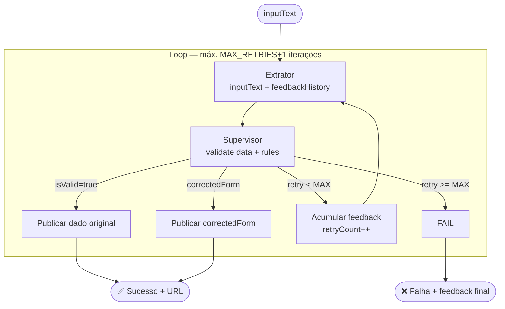

# Spec: Retry Loop com Feedback Textual

**Versão:** 1.0
**Status:** Referência
**Autor:** Boro Agent
**Data:** 2026-03-13

---

## 1. Resumo

O Retry Loop é o mecanismo que conecta o Supervisor ao Extrator quando a validação falha. Em vez de simplesmente re-executar a extração com o mesmo input (que geraria o mesmo erro), o loop injeta o `feedback` textual do Supervisor na próxima chamada ao Extrator, direcionando a correção para o campo específico que falhou. Máximo de `MAX_RETRIES` tentativas (padrão: 3), após o qual o workflow falha de forma controlada.

---

## 2. Contexto e Motivação

**Problema:**
Retry sem feedback é ineficiente: o Extrator comete o mesmo erro na segunda e terceira tentativas porque não sabe o que errou. A taxa de sucesso em retries cegos é ~10% — praticamente aleatório.

**Evidências:**
No projeto antigo, os retries com feedback do Supervisor tinham taxa de sucesso de ~80% na segunda tentativa e ~95% acumulado em 3 tentativas. O feedback "o campo `nivel` retornou 'Pleno/Sênior' — use apenas 'Sênior' (o mais alto quando houver ambiguidade)" resolve o problema diretamente.

**Por que agora:**
O loop é o componente que transforma o pipeline de "best effort" em "garantido ou falha informada". Sem ele, erros do Extrator chegam ao destino final silenciosamente.

---

## 3. Goals (Objetivos)

- [ ] G-01: Implementar `MultiAgentWorkflow<T>` genérico que orquestra Extrator → Supervisor → Publicador com retry automático.
- [ ] G-02: Garantir que cada retry injeta o feedback acumulado do Supervisor, não apenas o último.
- [ ] G-03: Manter estado imutável a cada iteração — nunca modificar o dado original, sempre criar cópias.

---

## 4. Non-Goals (Fora do Escopo)

- NG-04: Não implementa retry por falha de infraestrutura (timeout de API, erro de rede). Isso é responsabilidade do provider LLM.
- NG-02: Não tenta corrigir o dado por conta própria — a correção é delegada ao Supervisor (`correctedForm`) ou ao Extrator via feedback.

---

## 5. Estado do Workflow

```typescript
// src/lib/workflow/WorkflowState.ts

export interface WorkflowState<T> {
  inputText: string;           // texto bruto original — NUNCA modificado
  extracted: T | null;         // output do Extrator na iteração atual
  validationResult: ValidationResult<T> | null;  // resultado do Supervisor
  issueUrl: string | null;     // resultado da publicação
  retryCount: number;          // número de retries já executados
  feedbackHistory: string[];   // histórico de feedbacks acumulados
}

export const initialState = <T>(inputText: string): WorkflowState<T> => ({
  inputText,
  extracted: null,
  validationResult: null,
  issueUrl: null,
  retryCount: 0,
  feedbackHistory: []
});
```

---

## 6. Implementação do Workflow

```typescript
// src/lib/workflow/MultiAgentWorkflow.ts

import { z } from "zod";
import { IStructuredLLMClient } from "../structured-llm/IStructuredLLMClient";
import { SupervisorAgent } from "../supervisor/SupervisorAgent";
import { decideSupervisorAction } from "../supervisor/WorkflowDecision";

export interface ExtractorFn<T> {
  (inputText: string, feedbackHistory: string[]): Promise<T>;
}

export interface PublisherFn<T> {
  (data: T): Promise<string>; // retorna URL ou ID do recurso criado
}

export interface WorkflowConfig<T extends z.ZodType> {
  schema: T;
  extractor: ExtractorFn<z.infer<T>>;
  publisher: PublisherFn<z.infer<T>>;
  supervisorRules: SupervisorRule[];
  supervisorClient: IStructuredLLMClient;
  maxRetries?: number;    // padrão: 3
}

export class MultiAgentWorkflow<T extends z.ZodType> {
  private supervisor: SupervisorAgent<T>;
  private maxRetries: number;

  constructor(private config: WorkflowConfig<T>) {
    this.supervisor = new SupervisorAgent(config.supervisorClient, config.schema);
    this.maxRetries = config.maxRetries ?? 3;
  }

  async run(inputText: string): Promise<WorkflowResult<z.infer<T>>> {
    let state = initialState<z.infer<T>>(inputText);

    while (state.retryCount <= this.maxRetries) {
      // ── Etapa 1: Extração ──────────────────────────────────────
      console.log(`[Workflow] Extração — tentativa ${state.retryCount + 1}/${this.maxRetries + 1}`);

      state.extracted = await this.config.extractor(
        state.inputText,
        state.feedbackHistory
      );

      console.log("[Workflow] Dado extraído:", JSON.stringify(state.extracted, null, 2));

      // ── Etapa 2: Validação ─────────────────────────────────────
      state.validationResult = await this.supervisor.validate(
        state.extracted,
        this.config.supervisorRules
      );

      console.log(`[Workflow] Supervisor: isValid=${state.validationResult.isValid} | feedback="${state.validationResult.feedback}"`);

      // ── Etapa 3: Decisão ───────────────────────────────────────
      const decision = decideSupervisorAction(
        state.validationResult,
        state.retryCount,
        this.maxRetries
      );

      switch (decision.action) {
        case "publish":
          console.log("[Workflow] Publicando dado aprovado...");
          state.issueUrl = await this.config.publisher(decision.data);
          return { success: true, url: state.issueUrl, data: decision.data, retries: state.retryCount };

        case "publish_corrected":
          console.log("[Workflow] Publicando correctedForm do Supervisor...");
          state.issueUrl = await this.config.publisher(decision.data);
          return { success: true, url: state.issueUrl, data: decision.data, retries: state.retryCount };

        case "retry":
          console.log(`[Workflow] Retry ${state.retryCount + 1} — feedback: "${decision.feedback}"`);
          // Acumula feedback para injetar no próximo Extrator
          state = {
            ...state,
            extracted: null,
            validationResult: null,
            retryCount: state.retryCount + 1,
            feedbackHistory: [...state.feedbackHistory, decision.feedback]
          };
          break; // volta para o while

        case "fail":
          console.error("[Workflow] Falha após max retries:", decision.feedback);
          return { success: false, error: decision.feedback, retries: state.retryCount };
      }
    }

    // Nunca deve chegar aqui, mas TypeScript exige
    return { success: false, error: "Loop encerrado sem decisão", retries: state.retryCount };
  }
}

export interface WorkflowResult<T> {
  success: boolean;
  url?: string;
  data?: T;
  error?: string;
  retries: number;
}
```

---

## 7. Como o Extrator Usa o Feedback

```typescript
// src/skills/tech-recruiter/extractor.ts

import { AnthropicStructuredClient } from "../../lib/structured-llm/AnthropicStructuredClient";
import { VacancyFormSchema, VacancyForm } from "./schema";
import { TECH_RECRUITER_SYSTEM_PROMPT } from "./prompts";
import { extractFirstLine } from "../../lib/deterministic/extractFirstLine";

const client = new AnthropicStructuredClient(process.env.ANTHROPIC_API_KEY!);

export async function extractVacancy(
  inputText: string,
  feedbackHistory: string[]   // ← injetado pelo Workflow em retries
): Promise<VacancyForm> {

  const messages: ChatMessage[] = [
    { role: "system", content: TECH_RECRUITER_SYSTEM_PROMPT }
  ];

  // Em retries, adiciona contexto de correção ANTES do texto da vaga
  if (feedbackHistory.length > 0) {
    const feedbackContext = [
      "⚠️ ATENÇÃO: Esta é uma tentativa de correção.",
      "Nas tentativas anteriores, os seguintes problemas foram encontrados:",
      ...feedbackHistory.map((f, i) => `  Tentativa ${i + 1}: ${f}`),
      "Corrija especificamente esses pontos ao extrair o dado abaixo."
    ].join("\n");

    messages.push({ role: "user", content: feedbackContext });
    messages.push({ role: "assistant", content: "Entendido. Vou corrigir esses pontos específicos na próxima extração." });
  }

  messages.push({ role: "user", content: inputText });

  const extracted = await client.generateStructuredOutput(messages, VacancyFormSchema);

  // Pós-processamento determinístico (não LLM)
  // Ver: deterministic-extraction.md
  extracted.vaga = extractFirstLine(inputText);

  return extracted;
}
```

---

## 8. Diagrama Completo do Loop



---

## 9. Feedback Acumulado vs. Apenas Último Feedback

**Por que acumular feedbacks?**

```
Tentativa 1 — Extrator retorna: nivel="Pleno/Sênior", vaga="🚀 Dev Sênior"
Supervisor feedback: "nivel deve ser apenas 'Sênior'"

Tentativa 2 — Extrator corrige nivel mas mantém vaga com emoji
  (sem acumulação, só viu feedback da tentativa 1)
Supervisor feedback: "vaga não deve conter emojis"

Tentativa 3 — Com acumulação, Extrator recebe ambos os feedbacks e corrige tudo
```

**Sem acumulação:** A cada retry, o Extrator pode corrigir um erro mas criar outro que já havia sido corrigido antes (regressão). Com acumulação, o contexto de "o que já foi corrigido" se preserva.

---

## 10. Configuração do MAX_RETRIES

```typescript
// .env
MAX_RETRIES=3  // padrão recomendado

// Raciocínio:
// - 0 retries: Extrator + Supervisor. Se falhar, publica correctedForm ou falha.
// - 1 retry:   +1 LLM call. Resolve ~80% dos casos simples.
// - 2 retries: +2 LLM calls. Resolve ~95% dos casos.
// - 3 retries: +3 LLM calls. Resolve ~99%. Limite prático de custo/benefício.
// - 4+ retries: Custo crescente sem ganho proporcional de qualidade.
```

**Custo total de LLM calls por item:**

| MAX_RETRIES | Caso ideal | Caso médio | Pior caso |
|---|---|---|---|
| 3 | 2 calls (extrator + supervisor) | 4 calls | 8 calls |

---

## 11. Integração com o Boro (AgentLoop)

O `MultiAgentWorkflow` pode ser invocado de duas formas dentro do Boro:

**Opção A: Tool dedicada que encapsula o workflow inteiro**
```typescript
// src/tools/ProcessVacancyTool.ts — o AgentLoop chama uma única tool
class ProcessVacancyTool extends BaseTool {
  async execute({ text }: { text: string }) {
    const result = await vacancyWorkflow.run(text);
    if (result.success) return `Issue criada: ${result.url}`;
    return `Falha: ${result.error}`;
  }
}
```

**Opção B: Tools separadas orchestradas manualmente pelo AgentLoop**
```
Tool: extract_vacancy(text) → VacancyForm JSON
Tool: validate_vacancy(form) → ValidationResult JSON
Tool: create_github_issue(form) → URL
```
*(Opção B permite ao LLM raciocinar sobre os resultados intermediários — mais transparente, mais tokens)*

**Recomendação:** Opção A para skills com lógica de retry complexa. Opção B para debugging e experimentação.

---

## 12. Requisitos Funcionais

| ID | Requisito | Prioridade | Critério de Aceite |
|----|-----------|-----------|-------------------|
| RF-01 | Workflow nunca executa mais de `MAX_RETRIES + 1` chamadas ao Extrator | Must | Teste com MAX_RETRIES=2: máximo 3 calls ao extractor |
| RF-02 | Feedback é acumulado entre retries | Must | Na tentativa 3, o prompt contém feedbacks da tentativa 1 e 2 |
| RF-03 | `correctedForm` válido deve ser publicado diretamente sem retry | Must | Supervisor retorna correctedForm → workflow publica sem chamar Extrator novamente |
| RF-04 | Estado do workflow é imutável por iteração (spread operator) | Should | Modificar `state.retryCount` não afeta o estado da iteração anterior |

---

## 13. Edge Cases e Tratamento de Erros

| Cenário | Comportamento esperado |
|---|---|
| Extrator lança exceção (timeout, API error) | Capturar, incrementar retryCount, adicionar `"Erro técnico na extração"` ao feedbackHistory |
| Supervisor lança exceção | Capturar e tratar como `isValid: false` sem `correctedForm` para forçar retry |
| Publisher lança exceção | Não incrementar retryCount — erro de infraestrutura, não de dado. Propagar como falha não recuperável |
| `feedbackHistory` muito longo (muitos retries) | Usar apenas os últimos 2 feedbacks para evitar context overflow no LLM |

---

## 14. Open Questions

- Definir se o `feedbackHistory` deve ser limitado a N entradas (ex: apenas último feedback, não acumulado) para reduzir tokens em workflows com MAX_RETRIES alto.
- Avaliar se retries devem usar um modelo LLM mais capaz (ex: começar com Flash, trocar para Pro no retry 2) para aumentar qualidade sem custo excessivo nas tentativas iniciais.
