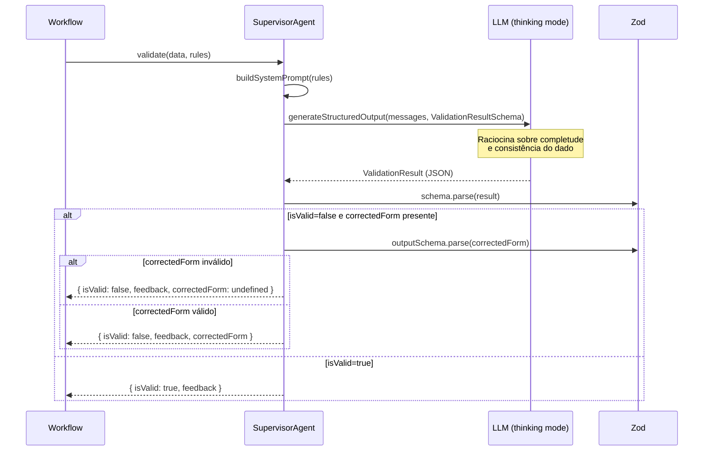

# Spec: Supervisor Agent (Agente Validador)

**Versão:** 1.0
**Status:** Referência
**Autor:** Boro Agent
**Data:** 2026-03-13

---

## 1. Resumo

O Supervisor Agent é um segundo LLM call dedicado exclusivamente à validação e correção do output gerado pelo Agente Extrator. Ele recebe o `OutputSchema` já estruturado (após passar pelo Zod), verifica completude semântica e consistência de negócio, e retorna um `ValidationResult` que pode conter:

- `isValid: true` → dado aprovado, pronto para publicar
- `isValid: false` + `correctedForm` → dado corrigido pelo próprio Supervisor, publicar diretamente
- `isValid: false` sem `correctedForm` → dado não corrigível, enviar `feedback` textual ao Extrator e fazer retry

O Supervisor tem contexto limpo (não vê o texto bruto original), só recebe o JSON estruturado. Isso o força a raciocinar sobre dados, não sobre intenção.

---

## 2. Contexto e Motivação

**Problema:**
Um único agente que extrai E valida acumula viés: ele tende a aprovar o próprio output mesmo com falhas, pois "acha que entendeu" o texto original. Validação no mesmo prompt é confirmação, não revisão.

**Evidências:**
No projeto antigo, o TechRecruiter sozinho aprovava outputs com `area: "Indefinido"` quando a vaga claramente era de Dev. Ao separar o Supervisor, esse campo passou a ser corrigido em ~95% dos casos porque o Supervisor analisa o dado sem a âncora do texto original.

**Por que agora:**
O padrão de Supervisor é um componente reutilizável — qualquer skill que gere dados estruturados pode plugar um Supervisor sem mudar a lógica de extração.

---

## 3. Goals (Objetivos)

- [ ] G-01: Implementar a função `validateOutput<T>` genérica que aceita qualquer schema Zod e retorna `ValidationResult<T>`.
- [ ] G-02: Definir o system prompt do Supervisor com regras de validação específicas de negócio passadas em runtime (não hardcoded).
- [ ] G-03: Garantir que `correctedForm` sempre contenha todos os campos obrigatórios quando `isValid=false` — nunca um form parcialmente corrigido.

---

## 4. Non-Goals (Fora do Escopo)

- NG-01: O Supervisor não reformata texto, não melhora escrita, não adiciona informações que não estavam no dado recebido. Ele apenas corrige campos estruturais (enums inválidos, campos vazios, inconsistências).
- NG-02: O Supervisor não acessa o texto bruto original do usuário. Sua visão é limitada ao JSON estruturado.
- NG-03: O Supervisor não decide se publicar ou não — essa decisão pertence ao Workflow que consome o `ValidationResult`.

---

## 5. Interface Pública

```typescript
// src/lib/supervisor/ISupervisor.ts

import { z } from "zod";

export interface ValidationResult<T> {
  isValid: boolean;
  feedback: string;       // sempre preenchido, mesmo quando isValid=true
  correctedForm?: T;      // preenchido quando isValid=false e Supervisor conseguiu corrigir
}

export interface SupervisorRule {
  field: string;          // nome do campo no schema
  rule: string;           // descrição da regra em linguagem natural
  example?: string;       // exemplo de valor correto vs incorreto
}

export interface ISupervisor<T> {
  validate(
    data: T,
    rules: SupervisorRule[]
  ): Promise<ValidationResult<T>>;
}
```

---

## 6. Implementação

### 6.1 SupervisorAgent

```typescript
// src/lib/supervisor/SupervisorAgent.ts

import { z } from "zod";
import { IStructuredLLMClient } from "../structured-llm/IStructuredLLMClient";

export class SupervisorAgent<T extends z.ZodType> implements ISupervisor<z.infer<T>> {
  private validationSchema: z.ZodType;

  constructor(
    private client: IStructuredLLMClient,
    private outputSchema: T
  ) {
    // Constrói o schema de ValidationResult dinamicamente com base no outputSchema
    this.validationSchema = z.object({
      isValid: z.boolean(),
      feedback: z.string().min(1),
      correctedForm: outputSchema.optional()
    });
  }

  async validate(
    data: z.infer<T>,
    rules: SupervisorRule[]
  ): Promise<ValidationResult<z.infer<T>>> {
    const systemPrompt = this.buildSystemPrompt(rules);
    const userMessage = JSON.stringify(data, null, 2);

    const result = await this.client.generateStructuredOutput(
      [
        { role: "system", content: systemPrompt },
        { role: "user", content: `Valide o seguinte dado:\n\n${userMessage}` }
      ],
      this.validationSchema,
      { thinking: true } // extended thinking para raciocínio mais cuidadoso
    );

    // Garantia de segurança: se isValid=false e há correctedForm,
    // o correctedForm DEVE passar no schema do output original
    if (!result.isValid && result.correctedForm) {
      try {
        this.outputSchema.parse(result.correctedForm);
      } catch (err) {
        // correctedForm inválido — tratar como se não existisse
        console.warn("[Supervisor] correctedForm não passou no schema Zod:", err);
        return { ...result, correctedForm: undefined };
      }
    }

    return result;
  }

  private buildSystemPrompt(rules: SupervisorRule[]): string {
    const rulesText = rules
      .map((r, i) => {
        let text = `${i + 1}. Campo \`${r.field}\`: ${r.rule}`;
        if (r.example) text += `\n   Exemplo: ${r.example}`;
        return text;
      })
      .join("\n");

    return `Você é um agente validador especializado. Sua única função é verificar se um dado estruturado está completo e consistente.

## Regras de Validação

${rulesText}

## Comportamento Esperado

- Se o dado está válido: retorne \`isValid: true\` e um feedback confirmando brevemente.
- Se encontrou problema mas consegue corrigir: retorne \`isValid: false\`, explique o problema em \`feedback\`, e forneça o dado totalmente corrigido em \`correctedForm\` com TODOS os campos preenchidos.
- Se não consegue corrigir (informação genuinamente ausente no dado): retorne \`isValid: false\`, feedback detalhado, sem \`correctedForm\`.

## Regras Absolutas

- NUNCA rejeite por questões estéticas (formatação, estilo de escrita).
- NUNCA deixe \`correctedForm\` com campos faltando — ou está completo ou não existe.
- NÃO adicione informações que não estão no dado recebido.
- Trate campos opcionais ausentes como válidos (não rejeite por isso).
- Use valores padrão ("Indefinido", "Empresa indefinida") para campos obrigatórios sem valor claro.`;
  }
}
```

### 6.2 Exemplo de uso em uma skill

```typescript
// src/skills/tech-recruiter/supervisor.ts

import { SupervisorAgent } from "../../lib/supervisor/SupervisorAgent";
import { AnthropicStructuredClient } from "../../lib/structured-llm/AnthropicStructuredClient";
import { VacancyFormSchema, VacancyForm, ValidationResult } from "./schema";

const client = new AnthropicStructuredClient(
  process.env.ANTHROPIC_API_KEY!,
  "claude-opus-4-6"  // modelo mais capaz para validação
);

const supervisor = new SupervisorAgent(client, VacancyFormSchema);

// Regras de negócio específicas da skill (não do Supervisor genérico)
const VACANCY_RULES = [
  {
    field: "nivel",
    rule: "Deve ser exatamente um dos valores: Júnior, Pleno, Sênior, Lead, Especialista, Indefinido. NUNCA valores combinados.",
    example: "ERRADO: 'Pleno/Sênior'. CORRETO: 'Sênior' (use o mais alto)"
  },
  {
    field: "area",
    rule: "Deve ser 'Dev' ou 'Business'. Use 'Dev' para qualquer vaga técnica, 'Business' para áreas como vendas, marketing, produto, jurídico.",
    example: "Data Scientist → 'Dev'. Product Manager → 'Business'"
  },
  {
    field: "vaga",
    rule: "Não deve conter emojis, a palavra 'VAGA:', localidade ou nome da empresa.",
    example: "ERRADO: '🚀 VAGA: Dev Sênior - SP'. CORRETO: 'Dev Sênior'"
  },
  {
    field: "stack",
    rule: "Deve ter valor. Se nenhuma tecnologia for mencionada, use 'Indefinido'.",
  },
  {
    field: "aplicar",
    rule: "Deve conter APENAS UM contato primário (URL, email ou telefone). Se houver múltiplos, manter o mais direto.",
  }
];

export async function validateVacancy(
  vacancy: VacancyForm
): Promise<ValidationResult<VacancyForm>> {
  return supervisor.validate(vacancy, VACANCY_RULES);
}
```

---

## 7. Fluxo Detalhado do Supervisor



---

## 8. Lógica de Decisão do Workflow após Supervisor

```typescript
// src/lib/supervisor/WorkflowDecision.ts

export type SupervisorDecision =
  | { action: "publish"; data: T }          // isValid=true
  | { action: "publish_corrected"; data: T } // isValid=false + correctedForm
  | { action: "retry"; feedback: string }    // isValid=false, sem correctedForm, retry < MAX
  | { action: "fail"; feedback: string };    // retry >= MAX

export function decideSupervisorAction<T>(
  result: ValidationResult<T>,
  retryCount: number,
  maxRetries: number
): SupervisorDecision {
  if (result.isValid) {
    return { action: "publish", data: result.correctedForm ?? /* original */ ({} as T) };
  }

  if (result.correctedForm) {
    return { action: "publish_corrected", data: result.correctedForm };
  }

  if (retryCount < maxRetries) {
    return { action: "retry", feedback: result.feedback };
  }

  return { action: "fail", feedback: result.feedback };
}
```

---

## 9. Por Que Usar o Supervisor ao Invés de Checklist no Prompt

| Critério | Checklist no Prompt (projeto novo) | Supervisor Agent (projeto antigo) |
|---|---|---|
| **Viés de confirmação** | Alto — mesmo LLM aprova o próprio output | Baixo — LLM diferente, contexto limpo |
| **Capacidade de correção** | Nenhuma — só identifica o erro | Retorna `correctedForm` já corrigido |
| **Custo** | Zero (sem LLM call extra) | +1 LLM call por item |
| **Confiabilidade** | Depende de seguir instruções do prompt | Garantida por schema Zod no `ValidationResult` |
| **Rastreabilidade** | `feedback` não existe | `feedback` sempre presente, auditável |
| **Bypass de retry** | Impossível | `correctedForm` permite publicar sem retry |

**Conclusão:** O custo de 1 LLM call extra é justificado quando o dado errado no destino final tem custo de correção alto (issue publicada errada, registro em banco, email enviado).

---

## 10. Requisitos Funcionais

| ID | Requisito | Prioridade | Critério de Aceite |
|----|-----------|-----------|-------------------|
| RF-01 | `validate()` deve retornar `ValidationResult` com schema Zod enforced | Must | `correctedForm` nunca viola o schema do output |
| RF-02 | `correctedForm` deve ter todos os campos quando presente | Must | Validar `correctedForm` com `outputSchema.parse()` antes de retornar |
| RF-03 | System prompt do Supervisor é gerado dinamicamente com as regras da skill | Must | Diferentes skills usam diferentes regras sem mudar o SupervisorAgent |
| RF-04 | Supervisor deve usar `thinking: true` quando o provider suporta | Should | Raciocínio estendido reduz aprovações incorretas em casos ambíguos |

---

## 11. Edge Cases e Tratamento de Erros

| Cenário | Comportamento esperado |
|---|---|
| `correctedForm` retornado pelo LLM viola o Zod schema | Zod.parse falha — tratar como `correctedForm: undefined`, forçar retry |
| LLM retorna `isValid: true` mas dado tem campo enum inválido | Não deveria acontecer — o schema Zod do `ValidationResult` não valida o conteúdo do `correctedForm`, apenas estrutura. Por isso o Zod check extra no `validate()` é necessário |
| Supervisor entra em loop de validação (aprova/reprova alternadamente) | O `retryCount` no Workflow impede — após MAX_RETRIES, falhar com último feedback |
| LLM retorna `feedback` vazio | `z.string().min(1)` no schema garante que isso jamais aconteça |

---

## 12. Dependências

| Dependência | Tipo | Impacto se indisponível |
|---|---|---|
| `IStructuredLLMClient` | Obrigatória | Supervisor não consegue chamar LLM |
| `zod` | Obrigatória | Sem validação de `correctedForm` |
| Qualquer provider com suporte a `thinking` | Opcional | Sem thinking, Supervisor ainda funciona mas com menor profundidade de raciocínio |

---

## 13. Open Questions

- Avaliar se o Supervisor deve usar o mesmo modelo do Extrator ou um modelo mais capaz (ex: Extrator usa Flash/Haiku para velocidade, Supervisor usa Opus/Sonnet para precisão).
- Definir se o feedback do Supervisor deve ser exibido ao usuário em caso de falha total (MAX_RETRIES atingido) ou apenas logado internamente.
